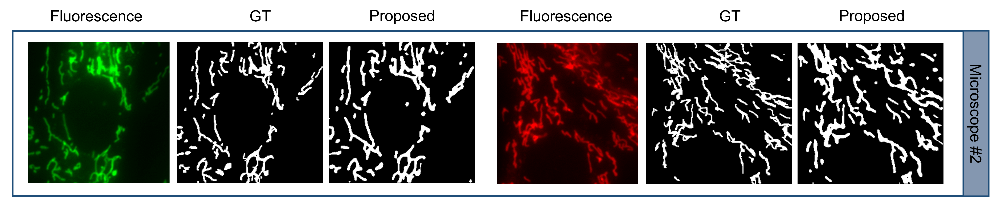

### Publication
[Sekh, Arif Ahmed](https://www.linkedin.com/in/arif1984/), Ida S. Opstad, Gustav Godtliebsen, Åsa Birna Birgisdottir, Balpreet Singh Ahluwalia, Krishna Agarwal, and Dilip K. Prasad. "Physics based machine learning for sub-cellular segmentation in living cells.
"Submitted in Nature Machine Intelligence. 2021. 
[Link to The Paper](https://www.nature.com/articles/s42256-021-00420-0)

 

### Description

### Software and Hardware
======================
OS: Windows 10  
GPU: NVIDIA Quadro RTX 6000  
Anaconda 64 bit with Python 3.6.8  
Matlab 2019b  

### Create conda environment with all required packages
conda env create --name segment --file=segment.yml 
activate segment 
OR 
install all dependency listed in segment.yml  

### Install Matlab Engine for Python

1. Installing the MatLab library  

Following the instructions of https://ch.mathworks.com/help/matlab/matlab-engine-for-python.html  
you first have to find your MatLab root folder by opening MatLab and running the command matlabroot.  
This should give you the root folder for Matlab.  

Then you open your terminal (if you are using Windows you can do that by pressing Windows + R, 
then type cmd and press Enter.)  
In the terminal you run following code:  

cd matlabroot\extern\engines\python  
Make sure to replace matlabroot with the Path you just found. Then you run  

python3 setup.py install  
To install the MatLab Python library.  

2. Using the MatLab Library  

Following the instructions of  
 https://ch.mathworks.com/help/matlab/matlab_external/call-matlab-functions-from-python.html You can then  

import matlab.engine  

==========================================
Follow the tutorial for running the code
### License

Copyright © 2021 Sk. Arif Ahmed

The content of this repository is bound by the following licenses:

- The documents and data are licensed under the MIT license.
